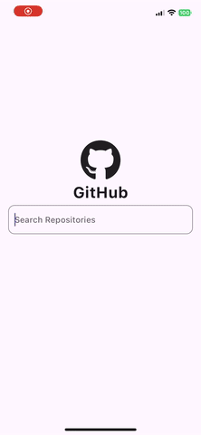
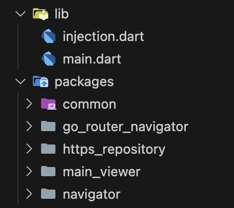
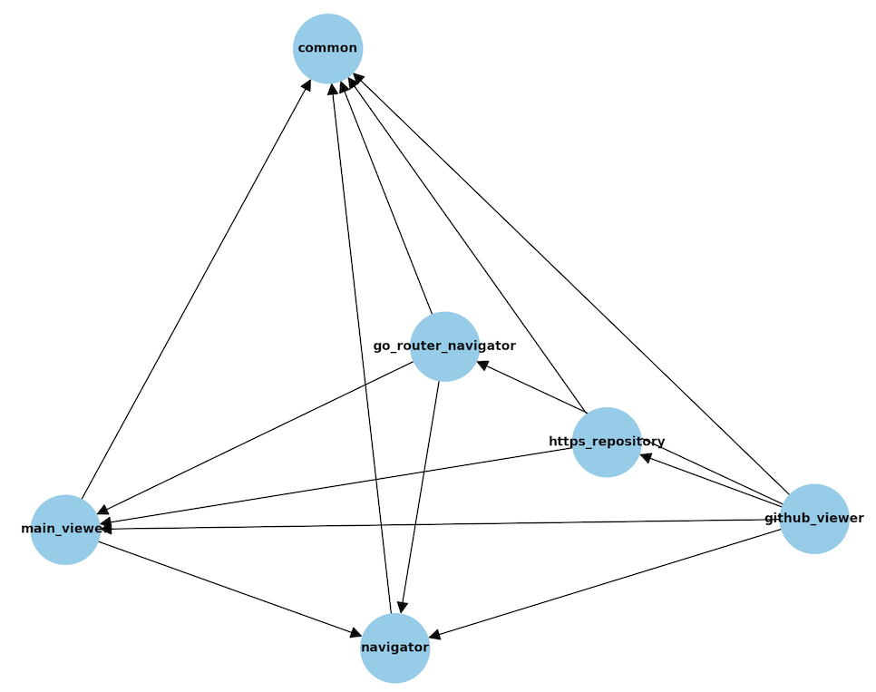

# 📱 GitHub Repository Viewer

Welcome to the GitHub Repository Viewer! This mobile app is written in Flutter and utilizes the GitHub API to fetch repositories and issues for selected repositories. It showcases how to use cubits with pagination for loading issues, making it an excellent demonstration of Flutter's capabilities and architectural patterns.

## 🌟 Features and Packages

- 📄 **GitHub Issues Pagination**: Efficiently load and display issues with pagination.
- 🎨 **Cool Animations**: Enhance user experience with animations using:
  - [animate_do](https://pub.dev/packages/animate_do)
  - [animated_loading_border](https://pub.dev/packages/animated_loading_border)
- 🧱 **State Management**:
  - [flutter_bloc](https://pub.dev/packages/flutter_bloc)
  - [bloc](https://pub.dev/packages/bloc)
- ❄️ **Code Generation**:
  - [freezed](https://pub.dev/packages/freezed)
  - [build_runner](https://pub.dev/packages/build_runner)
- 💉 **Dependency Injection**:
  - [injectable](https://pub.dev/packages/injectable)
  - [injectable_generator](https://pub.dev/packages/injectable_generator)
  - [get_it](https://pub.dev/packages/get_it)
- 🚀 **Routing**:
  - [go_router](https://pub.dev/packages/go_router)
- 🧪 **Testing**:
  - [mockito](https://pub.dev/packages/mockito)
  - [bloc_test](https://pub.dev/packages/bloc_test)
  - [patrol](https://pub.dev/packages/patrol)

## 🛠 How to Run

This app uses a monorepo structure managed by Melos.

1. **Activate Melos**:
   \`\`\`bash
   dart pub global activate melos
   \`\`\`

2. **Generate Files**:
   \`\`\`bash
   melos generate
   \`\`\`

3. **Run the App**:
   \`\`\`bash
   flutter run --dart-define=GITHUB_API_TOKEN=your_github_token
   \`\`\`

## 🗂 Project Structure

This project follows a monorepo structure. As projects scale, maintaining a clear separation of concerns and a clean structure becomes essential. Using a monorepo with multiple local packages creates clear boundaries between independent parts of the code.

The project comprises all packages placed inside the `packages/` folder:

### Key Packages:

- **common**: Should not have any dependencies on other local packages.
- **http_repository** and **go_router_navigator**: Implementations that other packages should not depend on. They are injected using [injectable](https://pub.dev/packages/injectable) and [get_it](https://pub.dev/packages/get_it).

The following image shows the dependency graph in the project:

To ensure package dependency constraints are not broken, you can use a simple Python script to verify them: [packages-verifier](https://github.com/kmrosiek/packages-verifier).

## 🌐 Navigation

The application is independent of the navigation package. Although the app uses the `go_router` package, no part of the code depends directly on `go_router` due to the navigator abstraction layer. This layer defines interfaces and route contracts that are fulfilled by the `go_router_navigator` package. However, since `go_router` is injected, all navigation should be tested thoroughly to avoid runtime errors.

### go_router_navigator

Uses named routes with type-safe parameters.

## 🧪 Tests

### Unit Tests

Blocs in this app are tested using the `bloc_test` package. Use Melos to run all tests:

\`\`\`bash
melos test
\`\`\`

### Integration Tests

Integration tests are set up using the `patrol` package (currently for iOS only). To run integration tests on a simulator:

1. **Activate Patrol CLI**:
   \`\`\`bash
   dart pub global activate patrol_cli
   \`\`\`

2. **Run Tests**:
   \`\`\`bash
   patrol test -t integration_test/app_test.dart
   \`\`\`

For more information, visit the [Patrol documentation](https://patrol.leancode.co/getting-started).

## 🐞 Known Bugs

- The textfield sometimes stops responding when popping from the repository details screen.
- Overflow appears when popping from the repository details screen for repository titles that span two lines in the search screen. This title gets displayed in a single line on the repository details screen and overflows when animated back to the search screen due to different card padding.

---

Thank you for exploring the GitHub Repository Viewer! We hope this project demonstrates the effective use of Flutter and its ecosystem. Happy coding! 🚀
